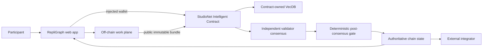

# RepliGraph — Architecture

## 1. Architectural thesis

RepliGraph does not decide whether science is true. It settles a narrower but valuable question: how does a new public experiment relate to prior experiments? Researchers register immutable protocols/results and claim a relation to earlier work. VecDB retrieves method-, question- and conclusion-near studies. GenLayer validators classify the relationship into direct replication, material variant, extension, contradictory result or incomparable. The output forms a public provenance graph.

The architecture preserves one boundary:

> High-volume creation/observation happens off-chain; **an immutable relation edge between two public study/protocol nodes** becomes authoritative only after a bounded GenLayer flow.

## 2. System context



Backend/service output is never the authoritative answer.

## 3. Components

### Web application

- domain workflow;
- public browsing;
- injected wallet;
- artifact preparation;
- live contract reads;
- transaction/finality rail;
- semantic-memory display;
- authoritative decision/history pages.

### Off-chain work plane

Frontend-first architecture. Next.js server routes may proxy public metadata lookups (Crossref/DOI/OSF/GitHub) for CORS and caching, but there is no app database in MVP and no signer. Chain is the graph of record.

### Intelligent Contract

Study nodes; protocol/result digests; semantic vectors; claimed relation cases; accepted relation edges; versioned corrections; consensus receipts.

### Contract-owned semantic memory

Maintain separate semantic memories for research question, method and conclusion. Each Study inserts three vectors pointing to the same study_id with a field_kind. New relation claims retrieve candidates in each field and present a small evidence matrix. Similarity only proposes related work; it does not establish replication.

## 4. Data ownership

| Data | Source of truth | Mutable | Consensus input |
|---|---|---:|---:|
| Draft/high-volume work | Off-chain service | Yes | No, until frozen |
| Frozen public artifact | Artifact store + chain digest | No | Yes |
| Rules/charter/rubric version | Contract | Versioned | Yes |
| VecDB pointer/vector | Contract | Append by invariant | Yes, bounded retrieval |
| Final status/receipt | Contract | Terminal/versioned | N/A; output |
| UI cache | Browser/service | Yes | Never authoritative |
| Deployment facts | Repository docs + explorer/chain | Append | N/A |

## 5. Domain contract model

- Study { registrant, title, question_text, method_text, conclusion_text, manifest_url, manifest_digest, publication_ref, version, created_at }
- RelationClaim { source_id, target_id, claimant, claimed_relation, evidence_url, evidence_digest, status, final_relation, rationale, reviewed_at }
- Edge { source_id, target_id, relation_code, claim_id, accepted_at }
- VectorPointer { study_id, field_kind }

## 6. Public contract surface

- register_study(title, question_text, method_text, conclusion_text, manifest_url, manifest_digest, publication_ref) -> study_id
- update_study_metadata(study_id, correction_url, correction_digest) -> version
- claim_relation(source_study_id, target_study_id, claimed_relation, evidence_url, evidence_digest) -> claim_id
- adjudicate_relation(claim_id) -> edge
- get_study(study_id)
- get_relation(claim_id)
- list_edges(study_id, offset, limit)
- search_related(study_id, field_kind, k)

Third-party consumers must be able to reconstruct the final status from views alone.

## 7. End-to-end sequence

```mermaid
sequenceDiagram
    participant P as Participant
    participant UI as Web
    participant OFF as Off-chain plane
    participant IC as Contract
    participant DB as VecDB
    participant VAL as Validators

    P->>UI: perform normal domain work
    UI->>OFF: save/aggregate/prepare
    OFF-->>UI: immutable public bundle + digest
    P->>UI: approve on-chain escalation
    UI->>IC: injected-wallet submit
    IC->>IC: deterministic preflight/version checks
    IC->>DB: bounded KNN
    DB-->>IC: eligible related memory
    IC->>VAL: rules + evidence + memories
    VAL->>VAL: independent fetch + judgment
    VAL-->>IC: equivalent bounded result
    IC->>IC: validate result + apply deterministic transition
    IC-->>UI: finalized transaction
    UI->>IC: re-read authoritative record
```

## 8. Semantic-memory path

Embedding inputs:

Maintain separate semantic memories for research question, method and conclusion. Each Study inserts three vectors pointing to the same study_id with a field_kind. New relation claims retrieve candidates in each field and present a small evidence matrix. Similarity only proposes related work; it does not establish replication.

Decision prompt fields:

- source/target versioned question
- source/target method
- source/target conclusion
- public manifest evidence
- claimed relation
- field-specific neighbor studies

The architecture deliberately separates **selection** from **judgment**. A memory hit is never enough to authorize the final transition.

## 9. Off-chain API/service boundary

Expected endpoints/categories:

- `GET /api/metadata/doi?doi=`
- `GET /api/metadata/github?url=`
- `GET /api/metadata/osf?url=`

If this project is frontend-first/no persistent database, those endpoints are limited metadata/cache proxies rather than an authority.

### Artifact freeze flow

```text
draft mutable data
  -> validate/publicity check
  -> canonical serialization
  -> SHA-256 digest
  -> immutable public object/ref
  -> user sees digest + preview
  -> injected-wallet chain submission
```

Once the digest is submitted, editing produces a new object/digest rather than replacing the old evidence.

## 10. Route architecture

| Route | Domain screen | Primary action |
| --- | --- | --- |
| / | Research graph canvas | Select/register study |
| /studies/new | Study registration sheet | Register study |
| /studies/[id] | Study dossier | Claim relation |
| /relations/new | Relation comparison | Submit relation |
| /relations/[id] | Method matrix | Run adjudication |
| /neighbors/[id] | Semantic neighbor drawer | Open candidate |
| /receipts/[id] | Edge receipt | Copy/explorer |

The full layout rules are in `ui/ux.md`.

## 11. State transition principles

Status vocabulary:

```text
REGISTERED, RELATION_CLAIMED, UNDER_REVIEW, EDGE_ACCEPTED, EDGE_REJECTED, INSUFFICIENT
```

Implement an explicit transition table in code/tests. Do not infer allowed transitions from ordering above.

A final record is immutable. Corrections create an explicit version/supersession/new case.

## 12. Consensus boundary

Decision:

> Given source study and candidate study manifests, do the methods and research question match closely enough for DIRECT_REPLICATION, or is the new work a MATERIAL_VARIANT/EXTENSION? If result direction materially differs, classify CONTRADICTORY_RESULT only when comparability is established. Otherwise INCOMPARABLE or INSUFFICIENT.

### Before nondeterminism

- role/identity;
- record exists;
- state allows review;
- base version current;
- sizes/counts bounded;
- immutable evidence refs syntactically valid;
- required enumerations allowed.

### Inside nondeterminism

- independently fetch public evidence where needed;
- interpret semantic evidence;
- compare retrieved memories for applicability;
- return fixed enums/bands/IDs.

### After nondeterminism

- validate all returned IDs/enums;
- re-check base state;
- deterministic arithmetic/state changes;
- memory insertion;
- events/counters.

## 13. Security boundaries

### User/caller

Cannot make user-submitted prose authoritative external evidence by assertion.

### Public evidence

Potential prompt injection. Bound and frame as data. Unavailable evidence fails closed.

### Semantic memory

Public and fallible as precedent/context. Namespace/version filters are deterministic.

### Off-chain service

Can coordinate; cannot sign/finalize chain.

### Wallet

Actual provider account/network immediately before signature is authoritative.

### Runtime

Finalized transaction status alone is not success; GenVM execution must be inspected.

## 14. Failure semantics

| Failure | Result |
|---|---|
| Artifact service unavailable before freeze | no submission |
| Evidence URL unavailable during consensus | explicit insufficient/failure; no positive state |
| No eligible VecDB memories | proceed only if domain rules permit; show “no related memory” |
| Validator disagreement | no unauthorized final state |
| Stale base version | reject before consensus |
| FINALIZED + rollback | show failure, re-read state |
| Malformed live read | unavailable, not empty/default |
| Backend stale cache | chain wins |

## 15. Scaling model

The product scales because the repeated/high-volume work is outside consensus.

- Paginate chain lists.
- Keep stored strings bounded.
- Use small vector pointers.
- Use deterministic domain filters around KNN.
- Keep validator context small.
- Split oversized cases/releases rather than raising every bound.
- Benchmark actual runtime before claiming large VecDB scale.

## 16. Observability

Log without secrets:

- artifact digest;
- record/case IDs;
- tx hashes;
- wallet chain changes;
- finality state;
- GenVM result;
- source fetch failure category;
- selected memory IDs;
- contract status after re-read.

## 17. Project invariants

- A relation edge always points to two existing immutable study versions.
- CONTRADICTORY_RESULT requires comparability; otherwise INCOMPARABLE.
- Semantic similarity alone cannot create an edge.
- Corrections increment study version and do not rewrite historical edge evidence.
- One claim produces at most one accepted edge.
- Public manifest digest is bound at registration.

## 18. Concrete test scenario

Study A tests treatment X in adults with method M and finds positive effect. Study B repeats M/population and finds no effect: potentially CONTRADICTORY_RESULT. Study C uses different population/method and should be MATERIAL_VARIANT, not contradiction.

## 19. Reference end-to-end demo

Register five synthetic/public studies with overlapping questions, claim a direct replication and a contradictory-result relation, show three-field semantic neighbors, adjudicate edges, then explore the resulting graph.
